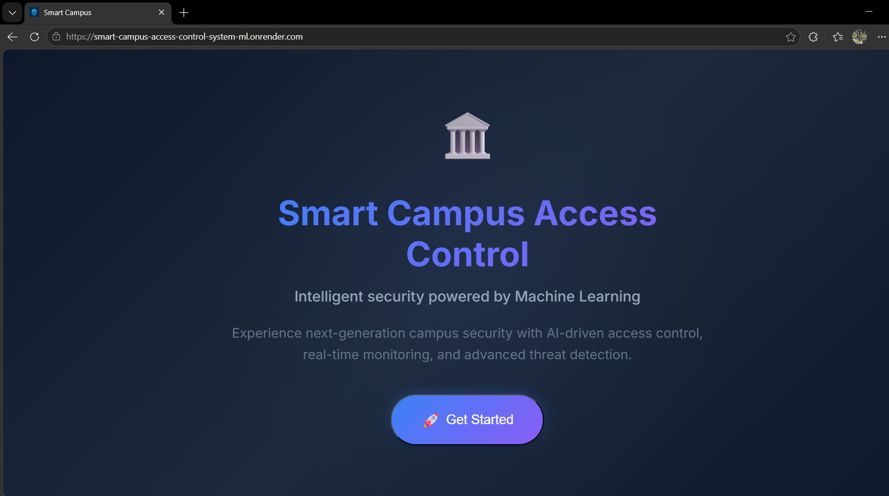
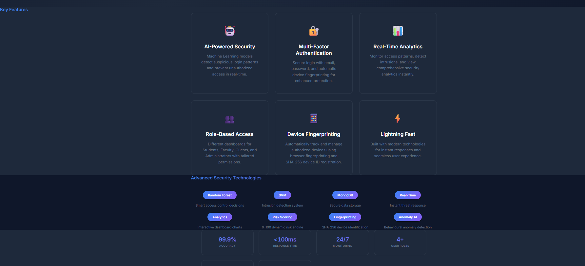
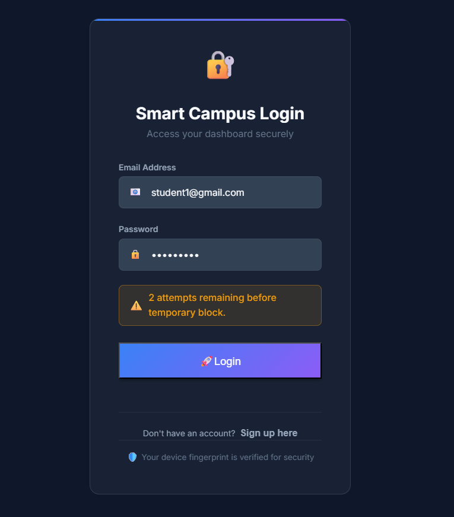
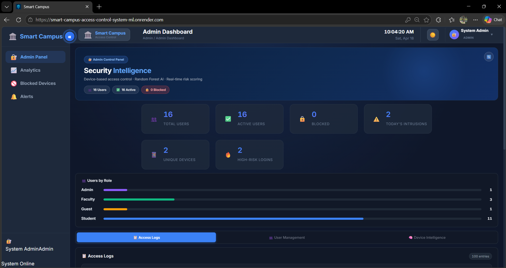
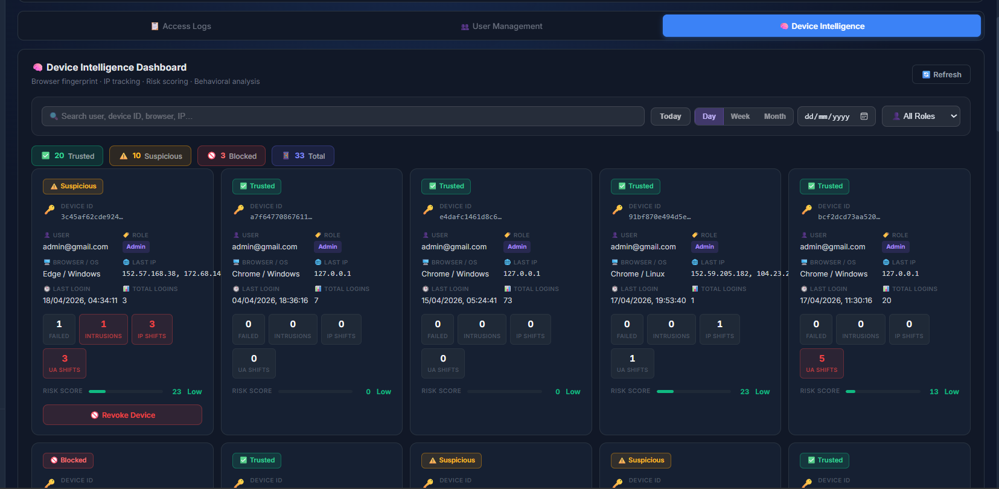
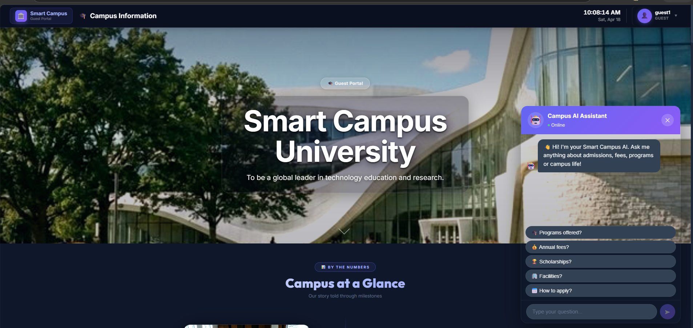

# Smart Campus Access Control System

> **AI-powered campus security platform** that detects suspicious access even when credentials are correct — combining device fingerprinting, behavioral analysis, and machine learning.

🔗 **Live Demo:** [smart-campus-access-control-system-ml.onrender.com](https://smart-campus-access-control-system-ml.onrender.com/)

---

## 🧭 Table of Contents

- [Problem Statement](#-problem-statement)
- [Solution](#-solution)
- [System Architecture](#-system-architecture)
- [Core Features](#-core-features)
- [Machine Learning](#-machine-learning)
- [User Roles](#-user-roles)
- [Screenshots](#-screenshots)
- [Tech Stack](#-tech-stack)
- [System Flow](#-system-flow)
- [Demo Credentials](#-demo-credentials)
- [Project Structure](#-project-structure)
- [Challenges & Learnings](#-challenges--learnings)
- [Real-World Applications](#-real-world-applications)

---

## ❗ Problem Statement

Most access control systems rely solely on **email + password authentication**. This creates serious security gaps:

- ❌ No device identity verification
- ❌ No behavioral or contextual analysis
- ❌ No anomaly detection on legitimate credentials
- ❌ Vulnerable to credential sharing, brute-force, and unauthorized access

---

## 💡 Solution

A **hybrid, behavior-aware authentication system** that goes beyond credentials:

```
User + Device + Behavior + ML → Access Decision
```

Every login is evaluated using device fingerprinting, risk scoring, and machine learning — blocking threats that traditional systems miss entirely.

---

## 🏗️ System Architecture

```
React Frontend (Vite)
        │
        ▼
Device Fingerprint (SHA-256)
        │
        ▼
Flask REST API
        │
        ▼
MongoDB Atlas (Database)
        │
        ▼
ML Models (Random Forest + SVM)
        │
        ▼
Admin Dashboard (Real-Time Monitoring)
```

The frontend and backend are fully decoupled, deployed independently on Render with JWT-based stateless authentication.

---

## 🔥 Core Features

### 📱 Advanced Device Fingerprinting

Each device is identified using a composite fingerprint:

| Signal | Description |
|--------|-------------|
| Canvas API | Unique GPU rendering signature |
| WebGL | Hardware/driver-level GPU identifier |
| Audio Context | OS-level audio processing signature |
| Browser signals | User-agent, language, timezone, screen resolution |

These signals are hashed into a **SHA-256 device ID**, more reliable than IP or MAC-based tracking.

---

### 🔐 Risk Scoring Engine

Every login generates a **risk score from 0–100** based on:

- New or unknown device detected
- Recent failed login attempts
- IP or browser environment changes
- ML model prediction output

---

### 🔒 Automated Lockout System

| Trigger | Action |
|---------|--------|
| 3 failed attempts | 8-hour automatic block |
| Repeated violations | Permanent block |
| Manual review | Admin unblock |

---

### 📊 Admin Security Dashboard

Functions as a **mini Security Operations Center (SOC)**:

- Real-time login activity monitoring
- Device identity tracking per user
- Intrusion alerts and risk score visualization
- Block / unblock user controls
- Analytics across all login events

---

### 💬 AI Campus Assistant

A chat-based assistant integrated into the guest dashboard, helping visitors explore campus information — fees, events, and facilities — without requiring a login.

---

## 🧠 Machine Learning

Two specialized models handle threat detection:

| Model | Role |
|-------|------|
| **Random Forest** | Access classification — Allowed / Restricted / Blocked |
| **SVM (Support Vector Machine)** | Intrusion detection — flags anomalous login patterns |

Both models are trained on login behavior features (device familiarity, failed attempt history, time-of-access, etc.) and run at every authentication event.

---

## 👥 User Roles

### 🛡️ Admin
- Full system visibility: users, devices, risk scores, intrusion flags
- Block/unblock accounts manually
- Access login analytics and security dashboards

### 🎓 Student
- View timetable, attendance, results, and announcements
- Access bookstore and submit feedback
- Subject to device tracking and ML anomaly detection

### 👨‍🏫 Faculty
- Manage student records and upload academic materials
- Post announcements and review feedback
- Same security monitoring as students, with elevated access

### 🌐 Guest
- Browse campus information (fees, events, facilities)
- Use the AI chatbot assistant
- No login required

---

## 📸 Screenshots

### 🏠 Landing Page




---

### 🔐 Login & Device Verification



---

### 📊 Admin Security Dashboard



---

### 📱 Device Monitoring Panel



---

### 💬 AI Campus Assistant



---

## ⚙️ Tech Stack

| Layer | Technology |
|-------|-----------|
| **Frontend** | React (Vite), Tailwind CSS, Axios |
| **Backend** | Flask, JWT Authentication, Gunicorn |
| **Database** | MongoDB Atlas |
| **ML** | Scikit-learn, Pandas, NumPy |
| **Deployment** | Render (Frontend + Backend, separate services) |

---

## 🔍 System Flow

### ✅ Normal Login
```
1. User submits credentials
2. Device fingerprint generated client-side
3. Backend validates credentials + device ID
4. ML models evaluate login context
5. Risk score computed (0–100)
6. JWT token issued → access granted
```

### ⚠️ Suspicious Login
```
1. Login from unrecognized device detected
2. ML models flag behavioral anomaly
3. High risk score generated
4. Admin alerted in real-time dashboard
5. Account flagged for manual review or auto-blocked
```

---

## 🔑 Demo Credentials

```
Email:    admin@gmail.com
Password: admin@127
Role:     Admin (full dashboard access)
```

---

## 📁 Project Structure

```
smart-campus-access-control/
├── frontend/        → React (Vite) UI
├── backend/         → Flask API + ML models
├── scripts/         → Utility and data scripts
└── render.yaml      → Deployment configuration
```

---

## 🧪 Challenges & Learnings

- **Dependency resolution:** Resolved NumPy and Scikit-learn version conflicts across environments
- **Deployment:** Navigated Render's build pipeline for simultaneous frontend + backend deploys
- **Environment variables:** Learned Vite's `import.meta.env` behavior vs. CRA's `process.env`
- **Database:** Solved MongoDB Atlas SSL/TLS connection issues in a hosted environment
- **Device fingerprinting:** Balanced fingerprint stability vs. uniqueness across browser updates

---

## 🌟 Real-World Applications

This architecture is directly applicable to:

- 🏫 Universities and educational institutions
- 🏢 Enterprise internal portals
- 🏥 Healthcare access management systems
- 🔐 Any platform requiring behavior-aware authentication

---

## 👨‍💻 Author

**Dashwanth Madduri**  
Full Stack Developer · AI/ML Enthusiast

---

> *Built over 3 months — from architecture design to production deployment on Render.*  
> *The goal was never just a login system. It was an intelligent security layer.*
